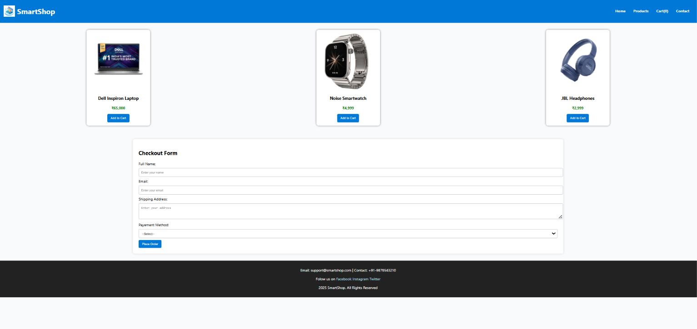

# SmartShop - Online Store Demo

A simple, responsive e-commerce landing page built with HTML, CSS, and JavaScript. This project demonstrates a basic product catalog, a functional cart counter, and a validated checkout form.

## 🎯 Project Objective
The goal of this project is to create a lightweight, user-friendly online store interface that showcases:
- Responsive web design using CSS Flexbox.
- Dynamic UI updates with JavaScript (Cart Counter).
- Client-side form validation for a smooth user experience.
- A clean and modern aesthetic suitable for e-commerce.

## 📂 Project Structure
```text
ecommerce-store-demo/
├── index.html        # Main HTML structure
├── styles.css        # Custom styling for the store
├── script.js         # Logic for cart and form validation
├── images/           # Product and logo assets
│   ├── headphones.jpg
│   ├── laptop.jpg
│   ├── smartwatch.jpg
│   └── logo.jpg
└── README.md         # Project documentation
```

## 🛠️ Steps to Create from Scratch

### 1. Setup Project Folder
Create a new directory for your project and add an `images/` folder inside it to store your product assets.

### 2. Create the HTML Structure (`index.html`)
- Define the `<!DOCTYPE html>` and basic tags (`<html>`, `<head>`, `<body>`).
- Create a `<header>` with a logo and navigation links.
- Use a `<section>` with a class like `product-container` to hold your product cards.
- Add a checkout `<form>` inside a `<section>` for user details and payment selection.
- Add a `<footer>` for contact information and social links.

### 3. Style the Application (`styles.css`)
- Use a clean font-family like 'Segoe UI'.
- Style the **Header** with a background color and `display: flex` for layout.
- Create **Product Cards** using `box-shadow`, `border-radius`, and `flexbox` for a responsive grid.
- Style the **Form** to be centered and visually appealing on all screen sizes.
- Customize the **Buttons** with hover effects for better interactivity.

### 4. Add Interactivity (`script.js`)
- **Cart Logic:** Create a function `addToCart()` that increments a global counter and updates the `innerText` of the cart icon/count.
- **Form Validation:** Create a `validateForm()` function to:
    - Check if all required fields are filled.
    - Use a regular expression (regex) to validate the email format.
    - Provide user feedback using `alert()` messages.

### 5. Final Polish
- Ensure all images are correctly linked.
- Test the responsiveness by resizing your browser.
- Verify that the "Add to Cart" button works and the form prevents submission if invalid.

## 🚀 How to Run
Simply open `index.html` in any modern web browser to view the application.

### Screenshot

